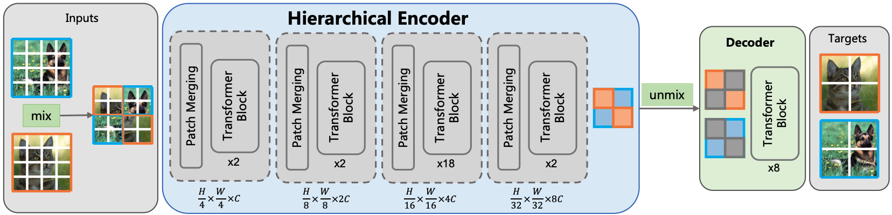

## Pytorch implementation of [MixMIM](https://arxiv.org/abs/2205.13137)



This repo is the offcial implementation of the paper [MixMIM: Mixed and Masked Image Modeling for Efficient Visual Representation Learning](https://arxiv.org/abs/2205.13137)

```
@article{MixMIM2022,
  author  = {Jihao Liu, Xin Huang, Yu Liu, Hongsheng Li},
  journal = {arXiv:2205.13137},
  title   = {MixMIM: Mixed and Masked Image Modeling for Efficient Visual Representation Learning},
  year    = {2022},
}
```


### Updates

***12/7/2022*** 
Release the source code and preprint paper.

### Availble models
|Models | Params (M) | FLOPs (G) | Pretrain Epochs | Top-1 Acc. | ckpt |
| :---: | :---: | :---: | :---: | :---: | :---: |
| MixMIM-B | 88 | 16.3 | 600 | 85.1 | -|

### Training and evaluation

We use [Slurm](https://slurm.schedmd.com/documentation.html) for multi-node distributed pretraining and finetuning. 

#### Pretrain
```
sh exp/base_600ep/pretrain.sh partition 16 /path/to/imagenet
```
- Training with 16 GPUs on your partition.
- Batch size is 128 * 16 = 2048.
- Default setting is to train for 600 epochs with mask ratio of 0.5.

#### Finetune
```
sh exp/base_600ep/finetune.sh partition 8 /path/to/imagenet
```
- Training with 8 GPUs on your partition.
- Batch size is 128 * 8 = 1024.
- Default setting is to finetune for 100 epochs.