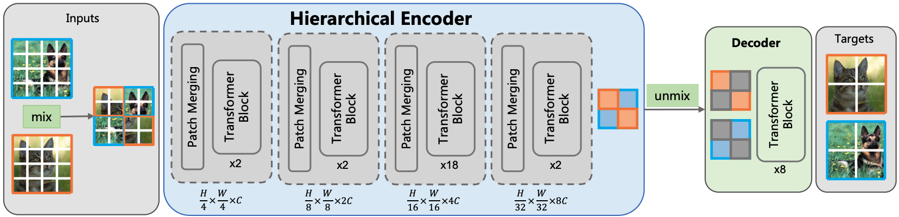

## Pytorch implementation of [MixMAE](https://arxiv.org/abs/2205.13137) (CVPR 2023)



This repo is the offcial implementation of the paper [MixMAE: Mixed and Masked Autoencoder for Efficient Pretraining of Hierarchical Vision Transformers](https://arxiv.org/abs/2205.13137)

```
@article{MixMAE,
  author  = {Jihao Liu, Xin Huang, Jinliang Zheng, Yu Liu, Hongsheng Li},
  journal = {arXiv:2205.13137},
  title   = {MixMAE: Mixed and Masked Autoencoder for Efficient Pretraining of Hierarchical Vision Transformers},
  year    = {2022},
}
```


### Availble pretrained models
|Models | Params (M) | FLOPs (G) | Pretrain Epochs | Top-1 Acc. | Pretrain_ckpt | Finetune_ckpt |
| :---: | :---: | :---: | :---: | :---: | :---: | :---: |
| Swin-B/W14 | 88 | 16.3 | 600 | 85.1 | [base_600ep](https://drive.google.com/file/d/1pZYmTv08xK_kOe2kk6ahuvgJVkHm-ZIa/view?usp=sharing) | [base_600ep_ft](https://drive.google.com/file/d/1zkOyh8jnFW7iYG3sOfp6LLG5wu4VbiXb/view?usp=sharing)| 
| Swin-B/W16-384x384 | 89.6 | 52.6 | 600 | 86.3 | [base_600ep](https://drive.google.com/file/d/1pZYmTv08xK_kOe2kk6ahuvgJVkHm-ZIa/view?usp=sharing) | [base_600ep_ft_384x384](https://drive.google.com/file/d/1MIng19USn5T770YZ6mFfqTgNCCz_kEGL/view?usp=sharing)| 
| Swin-L/W14 | 197 | 35.9 | 600 | 85.9 | [large_600ep](https://drive.google.com/file/d/1dM8Lu2nVEukxPwn7PLmDmRAYwQV59ttx/view?usp=sharing) | [large_600ep_ft](https://drive.google.com/file/d/1b1BxGAewK1ICxxCEwF24YEDSjlQ9Ts9n/view?usp=sharing) |
| Swin-L/W16-384x384 | 199 | 112 | 600 | 86.9 | [large_600ep](https://drive.google.com/file/d/1dM8Lu2nVEukxPwn7PLmDmRAYwQV59ttx/view?usp=sharing) | [large_600ep_ft_384x384](https://drive.google.com/file/d/1_IfqoQvAe2Z2jC7HBKi3umKD6c8qOu0P/view?usp=sharing)| 


### Training and evaluation

We use [Slurm](https://slurm.schedmd.com/documentation.html) for multi-node distributed pretraining and finetuning. 

#### Pretrain
```
sh exp/base_600ep/pretrain.sh partition 16 /path/to/imagenet
```
- Training with 16 GPUs on your partition.
- Batch size is 128 * 16 = 2048.
- Default setting is to train for 600 epochs with mask ratio of 0.5.

#### Finetune
```
sh exp/base_600ep/finetune.sh partition 8 /path/to/imagenet
```
- Training with 8 GPUs on your partition.
- Batch size is 128 * 8 = 1024.
- Default setting is to finetune for 100 epochs.